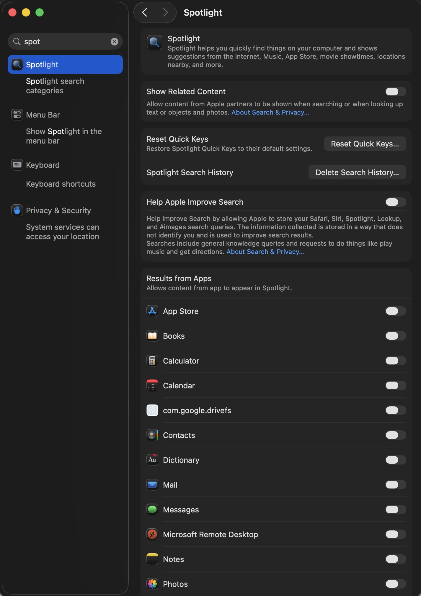
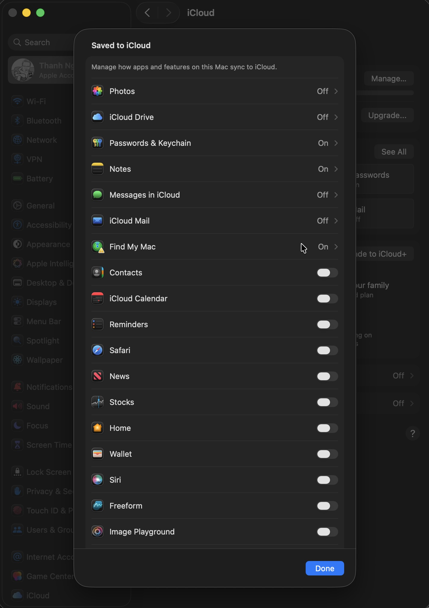

# macOS Bloatware Freezer Script

A lightweight, non-destructive Bash script to disable and freeze stubborn background processes, widgets, and Siri intents for pre-installed macOS applications that you don't use. 

Since modern macOS versions protect the system volume via **Signed System Volume (SSV)**, you cannot directly delete stock apps like *News*, *Home*, or *Weather*. However, this script completely freezes their CPU/RAM footprint by hunting down and disabling their underlying `LaunchAgents`, `LaunchDaemons`, and hidden App Extensions (`.appex`).

## 🚫 What This Script Disables

This script targets and shuts down both the core agents and hidden widget/Siri extensions for the following **15 apps/services**:
1. **News.app** (Core daemon, Today widgets, News tags, and Siri intents)
2. **Home.app** (Homed daemon, HomeHub syncing, Interactive & Energy widgets)
3. **Stocks.app** (Stocks daemon and finance widgets)
4. **Weather.app** (Weather daemon, forecast widgets, and Siri intents)
5. **Journal.app** (Journaling daemon and secure widgets)
6. **Podcasts.app** (Podcast agent and background widgets)
7. **VoiceMemos.app** (VoiceMemos daemon, Quick Record & Settings extensions)
8. **Calendar.app** (Background CalendarAgent, calendar widgets, and Siri intents)
9. **Clock.app** (Remote clock daemon, main widgets, and World Clock extensions)
10. **Siri** (Core assistant agents, Siri actions/suggestions bookkeeping, iCloud sync, and daemon processes)
11. **Notes.app** (Quick Notes widget extension)
12. **Reminders.app** (Reminders widget extension)
13. **Shortcuts.app** (Shortcuts widget, view service, and actions daemon)
14. **Photos.app** (Photos Relive widget extension)
15. **Tips.app** (Tips daemon and widget extension)

---

## 🚀 How to Use

### 1. Clone or Download the Script
Open your **Terminal** and create the script file:
```bash
nano debloat_mac.sh
```

*Paste the contents of `debloat_mac.sh` into the editor, press `Ctrl + O` then `Enter` to save, and `Ctrl + X` to exit.*

### 2. Make the Script Executable

Give the script permission to run:

```bash
chmod +x debloat_mac.sh
```

### 3. Run the Script

Execute the script:

```bash
./debloat_mac.sh
```

> **Note:** The script might prompt you for your administrator password (`sudo`) because disabling certain system-level background processes requires root privileges.

---

## 🌐 Cloudflare WARP Control (`warp.sh`)

If you use Cloudflare WARP but want to completely stop and freeze its background daemon and GUI client when not in use (saving RAM, CPU, and battery), you can use the `warp.sh` script.

### 1. Make the Script Executable

```bash
chmod +x warp.sh
```

### 2. Turn Cloudflare WARP OFF

To stop the daemon, prevent it from auto-starting, and close the running GUI client:

```bash
sudo ./warp.sh off
```

### 3. Turn Cloudflare WARP ON

To re-enable and start the background daemon:

```bash
sudo ./warp.sh on
```

---

## 🔎 Spotlight Indexing Control (`spotlight_index_off.sh`)

If you want to completely disable Spotlight indexing to save disk read/write activity and CPU resources, you can run the `spotlight_index_off.sh` script.

### 1. Make the Script Executable

```bash
chmod +x spotlight_index_off.sh
```

### 2. Run the Script

```bash
sudo ./spotlight_index_off.sh
```

---

## 🛠️ Chrome DevTools MCP Cleaner (`killall_chrome_devtools_mcp.sh`)

When the Antigravity agent runs, the Chrome DevTools MCP server may auto-start. You can use this script to terminate the background server process.

### 1. Make the Script Executable

```bash
chmod +x killall_chrome_devtools_mcp.sh
```

### 2. Run the Script

```bash
./killall_chrome_devtools_mcp.sh
```

---

## ⚙️ Manual System Settings Adjustments

For the best performance and to completely eliminate background synchronization overhead, you can configure these settings manually in macOS System Settings:

### 1. Disable Spotlight Search & Indexing
To prevent Spotlight from indexing your drives and consuming CPU/disk write cycles in the background:
1. Open **System Settings** > **Siri & Spotlight**.
2. Scroll down to the **Spotlight** section.
3. Uncheck categories you do not want indexed, or click on **Spotlight Privacy...** and add your drive (e.g., `Macintosh HD`) to disable indexing completely.



### 2. Disable iCloud Drive Syncing
iCloud background daemons (`cloudd`, `bird`) can frequently cause high CPU usage and data sync loops. To disable iCloud sync:
1. Open **System Settings** > **[Your Name / Apple ID]** > **iCloud**.
2. Click on **iCloud Drive**.
3. Toggle off **Sync this Mac**.



---

## 🔍 Verification

To verify that the applications and their hidden extensions are no longer wasting your RAM/CPU, you can audit them using the `ps` command. For example:

```bash
ps aux | grep -i Home.app
```

**Expected Result:** You should only see the single `grep` command itself running. All background widget pipelines (`.appex`) are successfully terminated.

---

## 🔄 How to Reverse (Re-enable Apps)

If you ever change your mind and want to use any of these apps again, you can easily re-enable their services via `launchctl`. For example, to bring back the **News** app:

```bash
launchctl enable user/$UID/com.apple.newsd
```

## ⚠️ Disclaimer

This script is completely safe and **does not modify or delete system files**. It only alters user-level configurations to prevent unneeded background daemons from launching. Feel free to fork and customize it to fit your workflow!
